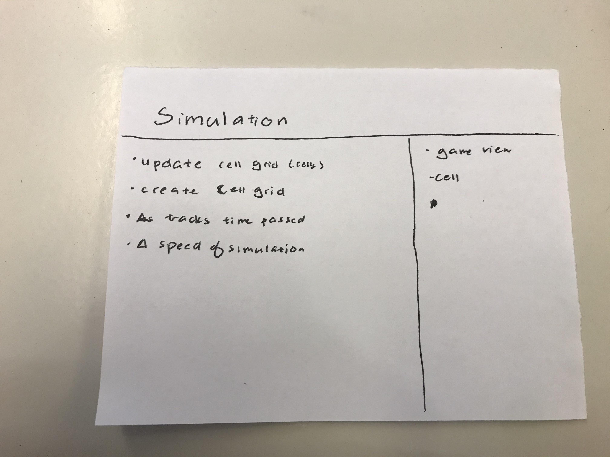
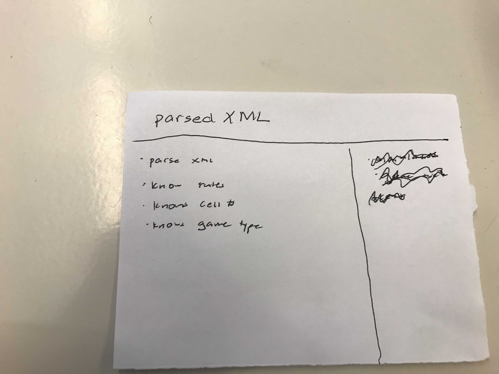
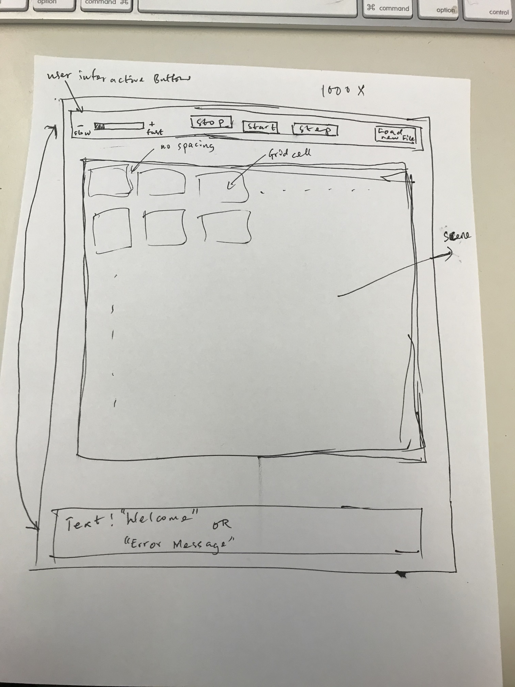

# Simulation Design Plan
### Team Number 13
### Names:

1. Franklin Boampong (fsb10)
2. Michelle Tai (mrt36)
3. Lucy Gu (wg74)

## Introduction

The goal of this program is to create a simulation animation capable of performing 
at least 4 different types of simulations; the user of the program should be able 
to interact with the program through keyboard or mouse input to stop, start, fast
forward through, or load new simulations. New types of simulations should be easy 
to add, so our code design must be flexible. Overall, our code should be most 
flexible in accepting new Cellular Automata (CA) simulations and in the playback 
of the simulation - i.e our code should consider each system as somewhat of a grid 
of cells such that the conditions of one cell is dependent on the surrounding cells 
in the system. 

The project should be organized in a way that has separate Model, 
view and Controllers to separate the data structures and applications from the 
visual display of information. Thus, we can encapsulate any front-end work or 
back-end work and keep them separate from each other. Things that should be open 
to extension and closed to modification are abstract classes like an overarching 
simulation type that has a way to display, a way to hold the data and cells information 
without having specific data structures tied to it, and encapsulate general behaviors 
of the CA simulation (like making new generations/simulations, etc). This helps us 
adhere to the open/close principle since any new types of simulations can extend 
this class without having to make changes to the original class itself. Also, in an 
effort to follow the open/close principle, we plan to have major subclasses which 
would be extended by subclasses. These main classes would have some simple method 
functions which all the subclasses might need. Pertaining to reading an XML file 
to layout contents of each simulation, a class that reads a general XML file would 
be used. In this case, we plan to implement class such that any File passed in an XML 
format could be read in by the class regardless of the type of simulation under consideration.

## Overview

 
 
 
 


## User Interface

“Load new File” allows user to load new XML file  
“Start” begins the animation (including initial begin)  
“Stop” pauses animation  
“Step” only activated when stopped? Step through each step  
“-” and “+” slow down/speed up the animation (only when simulation is started)  

An image showing the basic UI of the simulation view is shown below:

 


## Design Details

**Generic Game view Class:**
* Implements the basic view methods needed by each view. For example setUpScene() methods, 
private Simulation mySimulation;
* Scans the file for title, which simulation, initial configuration
* Sets up scene, stage, and display 
* Step function updates animation
* mySimulation.update(elapsedTime, factor)
* Input pause resume skip new  
**Simulation class**
* This class is in charge of updating the grid of cells and “stepping” through the simulation by updating
* Can extend this class for new simulations 
* Would need information from the xmlParser, cell
* Collaborates with Cell objects to tell them to update their states 
* This class supports the open/close principle, inheritance, and polymorphism since any new simulations can be added by extending this class in opposed to adding and changing code within the Simulation class itself. This class also supports encapsulation since it contains all the information and behavior needed for the simulation itself. 
* Abstract class (?) // I think that works
* Keep track of the cells grid(ArrayList<ArrayList<Integer>> myGrid = ArrayList<ArrayList<Cell>> ();)
* Keep track of time passed (?) (double time)
* Update() method   
**Game of Life implements simulation**
* This class is in charge of dealing with the simulation and its unique rules for the Game of Life simulation. 
* It collaborates with all the components the superclass, Simulation, interacts with
* This class supports the inheritance since it’s a subclass of Simulation, but also can have its own unique methods on top of the ones inherited from simulation. 
* Private int DEAD = 0; Private int ALIVE = 1; (?)
* Private double time = 0;
* Public GoL()
* Update (public void update(double elapsedTime, int factor))
* Time +=elapsedTime;
* If time>factor*elaspedTime, actually updates the list and reset time to 0; else do nothing
* Go through myGrid and set each cell’s next state to the state it should be based on the neighbours
* Go through myGrid again and update cell color to its next state  
**Percolation implements Simulation**
* This class is in charge of dealing with the simulation and its unique rules for the Percolation simulation. 
* It collaborates with all the components the superclass, Simulation, interacts with
* This class supports the inheritance since it’s a subclass of Simulation, but also can have its own unique methods on top of the ones inherited from simulation.
* Private int open = 1, percolate = 2, blocked = 0
* Update
* Check all percolate block’s neighbours and percolate opened blocks  
**Segregation implements Simulation**
* This class is in charge of dealing with the simulation and its unique rules for the Segregation simulation. 
* It collaborates with all the components the superclass, Simulation, interacts with
* This class supports the inheritance since it’s a subclass of Simulation, but also can have its own unique methods on top of the ones inherited from simulation.
* Private int red, blue, blank;
* Update
* Create a new ArrayList
* For each entry, if original is satisfied, put corresponding status down, else put down a placeholder (say 100) and record the number of each color of unsatisfied cell
* Go through the new ArrayList, for each 100, randomly select one of the three statuses, make sure number of each color remains the same
* Satisfies (private boolean satisfies(int x, int y))
* Returns true if the cell at x, y is satisfied with its location  
**Fire implements Simulation**
* This class is in charge of dealing with the simulation and its unique rules for the Fire simulation. 
* It collaborates with all the components the superclass, Simulation, interacts with
* This class supports the inheritance since it’s a subclass of Simulation, but also can have its own unique methods on top of the ones inherited from simulation.
* Private int Tree, Fire, Blank
* Update 
* Read in initial
* Use  a probabilistic model Math.random to update cells surrounding a burning cell  
**Cell**
* The cell handles updating a cell based on current state and also holds the next state, which helps update the grid as the simulation runs. It also determines how the cell is colored and the shape of the cell
* This abstracts away the behavior of a cell since we don’t want other classes to have to deal with the cell’s behavior if it’s not its job.   
**xmlParser**
* Will parse data needed for simulation from an XML file and “give” it to other methods/the main method to help initialize other classes
* Helps us not hardcode information (bad practice) 


PSEUDOCODE - Detailed example implementation of Simulation Project
Models -  Simulation
Views - GameView 
Controllers
```java

/** This is the main class of the simulation project
* It sets up the screen by creating instance of GameView class
**/
Public class SimulationMain{
	/**
    	 * Initialize what will be displayed and how it will be updated.
     	*/
   	 @Override
   	 public void start(Stage primaryStage){
            	GameView mainPageView = new GameView();
            	primaryStage = manager.getBaseStage();
            	primaryStage.show();
        }
   	 /**
   	  * Start the program.
    	 */
    	public static void main (String[] args) {
        		launch(args);
   	 }
}
}

/** This is the GameView class
*  Responsible for setting up the GUI
*  Has buttons to make game implementations possible
**/
Public class GameView
 {
	private  static final int WIDTH = an integer value ; // Add specific value 
	private  static final int HEIGHT = an integer value ; // Add specific value 
public static final int FRAMES_PER_SECOND = 60;
	public static final int MILLISECOND_DELAY = 1000 / FRAMES_PER_SECOND;
    	public static final double SECOND_DELAY = 1.0 / FRAMES_PER_SECOND;

	private AnchorPane myPane;
	private Scene myScene;
    	private Stage myStage;

	private Simulation mySimulation;
private Object myGridObjectFromParserXML;

	public GameView(){
		myPane = new AnchorPane();
        		myScene = new Scene(basePane, WIDTH, HEIGHT);
        		myStage = new Stage();
        		myStage.setScene(myScene);
        		myStage.setResizable(false);
        		createBackground();
        		createBottomButtons();
        		createBottomLabel();
        		createSubscenes();
KeyFrame frame = new KeyFrame(Duration.millis(MILLISECOND_DELAY), e -> {
            	try {
                		step(SECOND_DELAY);
            	} catch (FileNotFoundException ex) {
                	ex.printStackTrace();
           		 }
        		});
        		Timeline animation = new Timeline();
        		animation.setCycleCount(Timeline.INDEFINITE);
        		animation.getKeyFrames().add(frame);
        		animation.play();
	}
	Private void step(double secondDelay){
}
private void createBackground(){
// TO DO : write code to set background of the game view
}
private void createBottomButtons(){
// TO DO : create buttons that would be at top of game view
	// Buttons are -> start, stop, step, load, textfile
}
private void createBottomLabel(){
// TO DO : Add the bottom label which can be updated if 
}
}

/** Cell class serves as a superclass
*    class will be extended by other forms of grid cells specified by Prof 
*    Gets Info from Simulation to specify layout on the simulation screen
**/
Public class Cell{
	//Private Paint[] ColorList = {White, Black, Blue, Red, Yellow, Green};
	Private int index1, index2;
	Private int currentState;
	Private int nextState;
	//Private Rectangle cellImage;

	Public Cell (int x, int y, int width, int height, int status){
		Index1 = x;
		Index2 = y;
		cellImage = new Rectangle();
		cellImage.setWidth(width);
		cellImage.setHeight(height);
		cellImage.setX((x+0.5)*cellImage.getWidth());
		cellImage.setY((y+0.5)*cellImage.getHeight());
		currentState = status;
		nextState = status;
		//cellImage.setFill(ColorList[status]);
	}
	Public void changeNext(int i){
		nextState = i;
	}
	Public void updateState(){
		currentState = nextState;
		cellImage.setFill(ColorList[currentState]);
	}
}

/**

Public class Simulation{
	Private List<List<Cell>> cellGrid;
	Private double time;
	Public Simulation(List<List<Cell>> grid, int time){
		cellGrid = grid;
		this.time = time;
	}
	
	Private void makeGrid(int width, int height){
		cells
	}

	Public void update(doublcellsspedTime, int factor){
		time+=elapsedTime;
		if(time>elapsedTime*factor){
			updateGrid();
			time = 0;
		}
	}

	Private void updateGrid(){
	//loop through the grid and tell each cell to update
	// use checkCellNeighbour & update cell
	}
	Private void checkNeighbourAndUpdate(Cell cell,  List<Cell> neighbour){
	}
	Private updateCell(ce
}

Public class GoL extends Simulation{
	Private int DEAD = 0;
	Private int ALIVE = 1;
	Private double time;
	Public GoL(int width, int height){
		super(width, height);
		Time = 0;
	}
	Public void update(double elaspedTime, int factor){
	}
	@Override
	Private void updateGrid(){
		for(Cell cell:cellGrid){
			//get a list of neightbours
			//call checkNeighbourAndUpdate
		}
for(Cell cell:cellGrid){
			cell.updateState();
		}
	}
	Private void checkNeighbourAndUpdate(Cell cell, ArrayList<Cell> neighbour){
		//apply the rules and set cell’s nextState to corresponding state depending on neighbour’s state
	}
}


```


## Design Considerations

We decided to have one abstract Simulation class, and have all five different kinds of 
simulations (GoL, Percolate, Segregation, Wator, Fire) be separate classes that extend Simulation.  
Reading the XML file should be its own class, not a part of GameView.  
GameView should only take care of displaying animation, nothing related to the simulation logic  
Buttons shall have their own class  
We decide to have the buttons on the bottom of the screen and the error message on the top 
instead of the other way around  
No spacing between cells when displaying  


#### Components

The main components of the Simulation assignment are:
1. GameView Class - This is the basic UI screen for the simulation.
2. Simulation Class - Main engine of program 
    - We will have 5 more subclasses extending this abstract Simulation class.
3. Cell Class - Cells to Fill in Grid.
4. XML Class - Clcellso obtain data from XML file provided by user.


#### Use Cases
* Apply the rules to a middle cell: set the next state of a cell to dead by counting its number of neighbors using the Game of Life rules for a cell in the middle (i.e., with all its neighbors)
    * updateGrid() (simulation)  ⇒  checkNeighbourAndUpdate(cell, neighbourList) (sim) ⇒ updateCell (sim) ⇒ changeNext (cell)
* Apply the rules to an edge cell: set the next state of a cell to live by counting its number of neighbors using the Game of Life rules for a cell on the edge (i.e., with some of its neighbors missing)
    * updateGrid() (simulation)  ⇒  checkNeighbourAndUpdate(cell, neighbourList) (sim) ⇒ updateCell (sim) ⇒ changeNext (cell)  
* Move to the next generation: update all cells in a simulation from their current state to their next state and display the result graphically
    * updateState() (cell)
* Set a simulation parameter: set the value of a global configuration parameter, probCatch, for a simulation, Fire, based on the value given in an XML fire
    * getParameters() (xmlParser)
* Switch simulations: load a new simulation from an XML file, stopping the current running simulation, Segregation, and starting the newly loaded simulation, Wator
    * ifLoadFile() (gameView) && ifValidFile (xml) ⇒ new xmlParser(“newFileName”) ⇒ simulation = new Wator() (simulation)


## Team Responsibilities

 * Team Member #1 (Franklin Boampong)
	- Primary Role: Game view Class
	- Secondary Role: Fire

* Team Member #2 (Michelle Tai)
   -  Primary Role: XML class
   -  Secondary Role: Percolation

* Team Member #3 (Lucy Gu)
   - Primary Role: Cell, Simulation
   - Secondary Role: Game of Life, Segregation

Team Altogether: Work on Predator - Prey simulation together.


