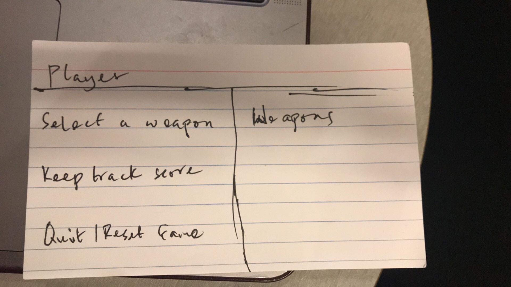
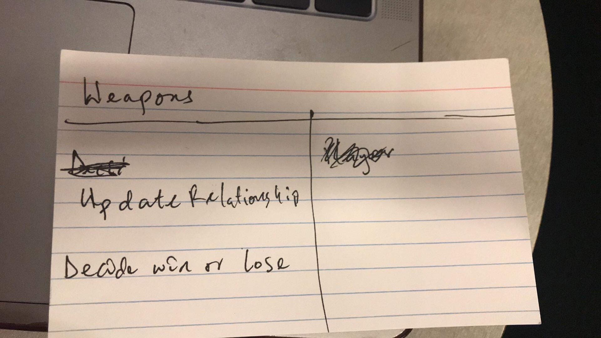
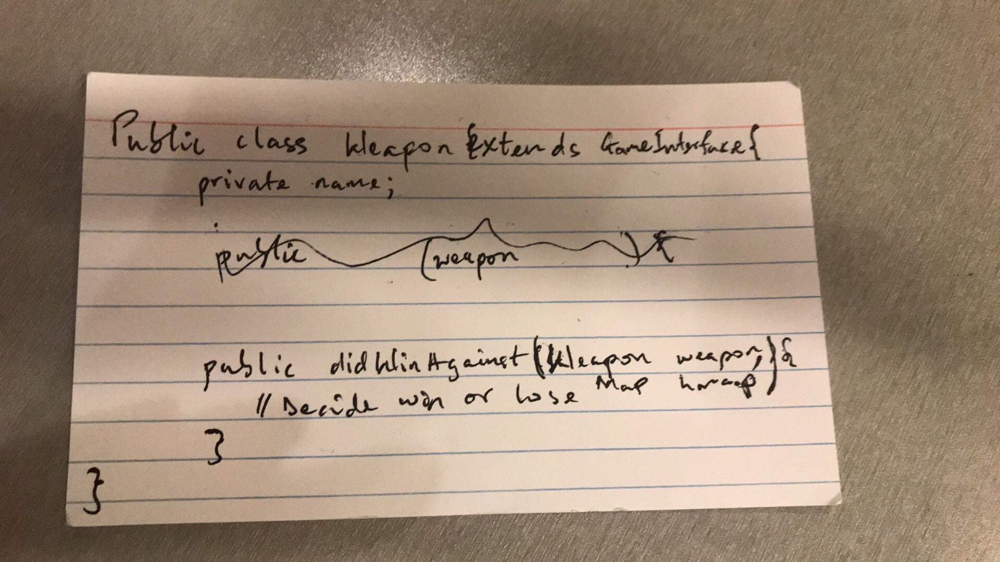

#RPS Design  
###Names/NetID:  
Lucy Gu (wg74)  
Michelle Tai (mrt36)  
Franklin Boampong (fsb10)

###Classes (basic CRC):  
Player Class
Weapon Class
Main/Game Class/Interface

* Player should be able to: 
    - Selects a weapon
    - Keep track of his/her score
    - Choose to quit/reset game
    
* Weapon should be able to:
    - Decide win or lose
    
* Game class should take input regarding the weapon types and the relationship
  between weapons and put them into a hashmap
  - The hashmap will have keys that correspond to each weapon type
  - The value corresponding to a key is an ArrayList of other types that the key will lose against
   
  
     
       
       

   


   
   
   
###Psuedo code/Java signatured CRC: 
```java
public class Player{  
    private Weapon choice;  
    private int score;
    
    public void selectWeapon(String type){
        //make a new weapon of the type for choice
    }
    public void updateScore(int n){
        //updates score
    }
}
```

```java
public class Weapon{  
    private String name;
    
    public int didWinAgainst(Weapon weapon1, Map relationship){
        //check if this weapon will win against weapon1
        //first check if the two weapons have the same type, if so, it's a tie (0)
        //then get the list of values corresponding to this weapon's key in the Map, check if weapon1 is on the arraylist
        //if weapon1's type is in the list, loses (-1); else wins (1)
    }
}
```

  
     
       
       

 